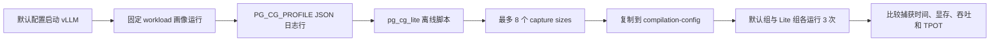

# PG-CG Lite：工作负载感知的 CUDA Graph 捕获尺寸剪枝——正式设计文档

| 文档属性 | 值 |
|---|---|
| 状态 | 核心规划器已切换为默认集合子集剪枝；Linux/A6000 验证待执行 |
| 版本 | 2.1 Lite |
| 日期 | 2026-08-31 |
| 目标框架 | vLLM |
| 开发基线 | `v0.27.1` / `6e448d0ea9bf3d88d898b65449ca6dc2aec170ac` |
| 验证硬件 | 单卡 NVIDIA RTX A6000 48 GiB，`sm_86` |
| 服务器现状 | NVIDIA 驱动 `535.230.02`；`nvidia-smi` 显示 `CUDA Version: 12.2`（不是 Toolkit 版本） |
| 建议模型 | `Qwen/Qwen2.5-7B-Instruct` revision `a09a35458c702b33eeacc393d103063234e8bc28`，BF16 |
| 项目定位 | 面试作品型、小规模推理框架二次开发 |

## 1. 结论与项目边界

PG-CG Lite 只做一个小点：

> 先观察固定工作负载实际使用的 scheduled-token 数量，再从默认 CUDA Graph 捕获尺寸中剪枝为最多 8 个尺寸，以降低 CUDA Graph 初始化时间和显存开销；吞吐与延迟只要求没有明显退化。

它不是新的推理引擎，也不修改调度策略、CUDA kernel 或在线请求热路径。项目的价值在于把 vLLM 已有的 CUDA Graph 指标变成一个简单、可解释、可直接应用的静态配置。

### 1.1 硬性规模预算

| 项目 | 上限 |
|---|---:|
| 修改或新增的代码、测试文件 | 5 个 |
| 新增生产代码 | 约 228 行 |
| 包含测试的总代码 | 约 412 行 |
| 正式实验模型 | 1 个 |
| 正式实验工作负载 | 1 个 |
| 正式对照组 | 2 个 |
| 每组重复次数 | 3 次 |
| 正确性请求 | 20 条 |
| 预计服务器实验时间 | 约 1～2 小时，不含首次模型下载和环境安装 |

超过以上预算的功能不进入本项目。

### 1.2 明确不做

- 不设计正式 JSONL 文件协议、schema 迁移或独立 writer。
- 不增加新的 vLLM 服务端配置字段。
- 不增加 `vllm bench` 子命令。
- 不实现在线学习、动态重捕获或自动重启。
- 不做训练集、调参集、留出集三路拆分。
- 不做 5 类 workload、10 次重启、置信区间推断或 8 小时 soak。
- 不支持 LoRA、speculative decoding、多模态、TP/PP/DP 多卡结论。
- 不承诺吞吐一定提升。
- 不把依赖补丁包装成自己的创新。

## 2. 问题定义

vLLM 会为一组静态 token batch sizes 预先捕获 CUDA Graph。运行时，本轮实际 token 数量会向上匹配到可用的 capture size；尺寸越密，padding 通常越少，但需要捕获和保存的图也越多。

因此存在一个很直观的工程权衡：

- 捕获尺寸多：启动 capture 时间和 graph memory 较高，运行时 padding 较低；
- 捕获尺寸少：启动成本较低，运行时 padding 可能增加；
- 默认规则不知道某台服务的真实流量分布，可能捕获长期很少命中的尺寸。

PG-CG Lite 不尝试求解所有推理性能问题，只回答：

> 对一个固定工作负载，能否只保留 8 个更有价值的 capture sizes，换取明显更小的初始化成本，同时保持服务性能基本不变？

## 3. 可验证假设

### 3.1 主假设

在固定模型、vLLM 版本、GPU 和 workload 下，将默认 capture-size 集合剪枝为 PG-CG Lite 选择的 8 个尺寸，将减少：

1. 配置中的 capture-size 数量；
2. vLLM 日志报告的 CUDA Graph 捕获时间；
3. vLLM 日志报告的 CUDA Graph 捕获显存。

### 3.2 非劣假设

相同 workload 下，候选配置相对默认配置：

- 请求吞吐中位数下降不超过 5%；
- median TPOT 上升不超过 5%；
- 20 条固定请求的 `generated_texts` 完全一致。

三次重复只用于降低偶然波动，不做统计显著性或生产 SLA 推断。

### 3.3 最低可交付结果

项目不以“必须提速”为完成条件。下面三种结果都可以诚实讲解：

| 结果 | 可得结论 |
|---|---|
| capture 时间、显存下降，吞吐非劣 | 小创新有效 |
| capture 时间、显存下降，但吞吐下降超过 5% | 剪枝过强，展示启动成本与 padding 的权衡 |
| capture 时间或显存没有明显下降 | 默认 capture 开销并非该环境的主要矛盾，保留负结果并分析 |

无论性能如何，“默认尺寸数与 8 个尺寸”的结构差异以及离线 padding 估计都必须清晰可见。

## 4. 为什么选择 vLLM

固定基线 vLLM v0.27.1 已经提供：

- `cudagraph_capture_sizes` 配置；
- 对实际 token 数量进行向上 padding 的 CUDA Graph dispatcher；
- `CUDAGraphStat` 和 `CUDAGraphLogging` 指标骨架；
- 启动日志中的 `Graph capturing finished in ... secs, took ... GiB`；
- `vllm bench serve` 的吞吐、TTFT、TPOT 和详细输出记录。

因此本项目只需补齐“机器可读画像”和“离线选择器”，不用重新实现 CUDA Graph。

## 5. 总体方案



在线服务只做低频日志输出。选择算法、JSON 解析和配置生成都在离线脚本中完成。

## 6. Phase 0：指标链路依赖

v0.27.1 的 GPU Model Runner V2 没有完整传播 `CUDAGraphStat`。项目需要回移已有修复，使真实请求的以下字段进入现有 scheduler metrics 链路：

- `num_unpadded_tokens`；
- `num_padded_tokens`；
- `num_paddings`；
- `runtime_mode`。

这部分来源于 vLLM issue #52728 和 PR #52750，对应补丁必须保留来源说明，不计入 PG-CG Lite 的原创实现。

只做一个冒烟门禁：服务带 `--cudagraph-metrics` 运行 20 条以上请求后，日志必须出现非空 `CUDAGraph Stats` 和 `PG_CG_PROFILE=`。如果没有，停止实验并修复链路，不允许用手工构造数据替代。

## 7. 最小机器可读画像

### 7.1 输出位置

复用已有 `CUDAGraphLogging.log()`。每个正常日志周期仍输出原有表格，并额外输出一行：

```text
PG_CG_PROFILE={"bins":[...],"capture_sizes":[...],"cudagraph_mode":"...","schema_version":1}
```

不创建新文件句柄，不增加配置字段。实验时直接将服务器 stdout/stderr 保存到日志文件，离线脚本搜索 `PG_CG_PROFILE=` 子串。

### 7.2 单条记录

```json
{
  "schema_version": 1,
  "cudagraph_mode": "FULL_AND_PIECEWISE",
  "capture_sizes": [1, 2, 4, 8, 16, 32, 64, 128, 256],
  "bins": [
    {
      "num_unpadded_tokens": 13,
      "num_padded_tokens": 16,
      "num_paddings": 3,
      "runtime_mode": "FULL",
      "count": 127
    }
  ]
}
```

约束保持最小：

- `schema_version` 固定为整数 `1`；
- `capture_sizes` 是本次服务解析后的升序正整数列表；
- `bins` 按稳定键排序，保证测试可重复；
- 只记录聚合计数，不记录 prompt、token id、文本或 request id；
- 多个日志周期由离线脚本简单累加；
- 不处理跨版本 schema 兼容。

## 8. 捕获尺寸选择算法

### 8.1 输入

离线脚本只聚合 `FULL` 和 `PIECEWISE` 事件，得到：

\[
(x_i,w_i),\quad 0 < x_1 < x_2 < \dots < x_n
\]

其中 (x_i) 是真实 `num_unpadded_tokens`，(w_i) 是出现次数。画像还必须提供 vLLM 本次实际解析的默认集合：

\[
C=(c_1<c_2<\dots<c_m),\qquad M=c_m
\]

`NONE` 事件只计数并报告，不参与尺寸选择，因为它不一定由 capture-size 上界导致。

### 8.2 约束

- 默认 `K=8`；
- 结果必须满足 `S ⊆ C`，不能生成默认集合之外的新尺寸；
- `1 <= |S| <= K`；
- 必须保留默认集合的最大尺寸 `M`，避免主动缩小已配置的可捕获上界。

### 8.3 目标函数

对升序集合 (S)，事件 (x) 映射到不小于它的最小端点：

\[
g_S(x)=\min\{s\in S\mid s\ge x\}
\]

预测 padding 为：

\[
L(S)=\sum_i w_i(g_S(x_i)-x_i)
\]

算法选择满足约束且 (L(S)) 最小的集合。代价相同时先选择尺寸更少的集合，再选择字典序更小的尺寸 tuple。该值只是可解释的 padding 代理指标，不是 GPU 延迟预测公式。

### 8.4 动态规划

候选端点只遍历默认集合 `C`。若前一个端点为 `c_p`、当前端点为 `c_j`，当前端点新增覆盖的画像需求满足 `c_p < x_i <= c_j`，区间代价为：

\[
cost(p,j)=\sum_{c_p<x_i\le c_j}w_i(c_j-x_i)
\]

首个端点使用负无穷哨兵。动态规划状态记录“使用指定数量的默认端点、最后停在 `c_j`”时的最小 padding 与端点 tuple；最终只比较以 `M` 结尾、尺寸数量为 `1..min(K,m)` 的状态。

对 `m` 个默认候选和 `n` 个画像需求点，当前直接实现的时间复杂度为 `O(Km² log n)`，空间复杂度为 `O(Km)`。默认集合只有几十个尺寸，该实现足够小且容易与穷举结果对拍。

### 8.5 输出

脚本生成一个小型 JSON：

```json
{
  "selection_policy": "default_capture_size_subset_dp",
  "max_capture_sizes": 2,
  "source_capture_sizes": [1, 2, 4, 8],
  "selected_capture_sizes": [1, 8],
  "profile_event_count": 10,
  "none_event_count": 0,
  "baseline_capture_size_count": 4,
  "selected_capture_size_count": 2,
  "baseline_predicted_padding_tokens": 3,
  "selected_predicted_padding_tokens": 15,
  "compilation_config": {
    "cudagraph_capture_sizes": [1, 8]
  }
}
```

这是用于解释字段的最小示例；正式运行仍使用默认 `K=8`，尺寸必须由服务器画像生成。

用户只需复制 `compilation_config` 到已有 `--compilation-config`，不需要新增 vLLM CLI。

## 9. 文件级实现范围

| 文件 | 操作 | 责任 |
|---|---|---|
| `vllm/v1/worker/gpu/model_runner.py` | 修改 | 回移指标传播补丁；属于实验依赖 |
| `vllm/compilation/cuda_graph.py` | 修改 | 生成稳定的 `PG_CG_PROFILE=` JSON 日志行 |
| `tests/v1/cudagraph/test_cudagraph_logging.py` | 新增 | 验证聚合计数、JSON 字段和稳定顺序 |
| `vllm/benchmarks/pg_cg_lite.py` | 新增 | 解析日志、聚合直方图、动态规划、输出配置 |
| `tests/benchmarks/test_pg_cg_lite.py` | 新增 | 验证解析、算法、错误输入和 CLI 输出 |

不修改 scheduler、dispatcher、`CompilationConfig`、engine args 或在线请求路径。

## 10. 用户工作流

### 10.1 运行默认画像

启动服务时启用现有指标：

```bash
vllm serve Qwen/Qwen2.5-7B-Instruct \
  --dtype bfloat16 \
  --max-model-len 4096 \
  --max-num-seqs 128 \
  --max-num-batched-tokens 4096 \
  --gpu-memory-utilization 0.85 \
  --cudagraph-metrics \
  2>&1 | tee logs/profile-server.log
```

用固定 workload 产生画像：

```bash
vllm bench serve \
  --backend vllm \
  --model Qwen/Qwen2.5-7B-Instruct \
  --endpoint /v1/completions \
  --dataset-name random \
  --input-len 512 \
  --output-len 128 \
  --num-prompts 300 \
  --request-rate inf \
  --max-concurrency 16 \
  --seed 2026 \
  --temperature 0 \
  --ignore-eos
```

### 10.2 生成计划

```bash
.venv/bin/python -m vllm.benchmarks.pg_cg_lite \
  --log logs/profile-server.log \
  --max-sizes 8 \
  --output logs/pg-cg-plan.json
```

脚本同时在人类可读摘要中打印尺寸数量、默认与候选的预测 padding，以及可以复制的配置 JSON。

### 10.3 应用候选配置

```bash
vllm serve Qwen/Qwen2.5-7B-Instruct \
  --dtype bfloat16 \
  --max-model-len 4096 \
  --max-num-seqs 128 \
  --max-num-batched-tokens 4096 \
  --gpu-memory-utilization 0.85 \
  --compilation-config '{"cudagraph_capture_sizes":[4,8,16,24,32,64,128,256]}' \
  2>&1 | tee logs/lite-run-1-server.log
```

示例尺寸只能由当前 Linux 服务器的真实画像生成，不允许直接照抄文档中的数字。

## 11. A6000 最小验证方案

### 11.1 环境前置门禁

`nvidia-smi` 中的 `CUDA Version: 12.2` 是驱动能力上限，与 PyTorch 实际加载的 CUDA runtime 不是同一个概念。R535 路线固定使用 vLLM v0.27.1 官方 `cu129` 轮子，并在实验开始前执行以下检查：

```bash
nvidia-smi
.venv/bin/python -c "import torch; print(torch.__version__, torch.version.cuda); print(torch.cuda.get_device_name(0)); print(torch.cuda.get_device_capability(0))"
.venv/bin/python -c "import torch; x=torch.randn(1024,1024,device='cuda'); print((x@x).norm().item())"
```

随后启动一次 vLLM，发送至少 20 条请求，并确认：

- 模型可以完成 compile 和 CUDA Graph capture；
- 日志包含 `Graph capturing finished in`；
- 日志包含非空 `CUDAGraph Stats`；
- 日志包含 `PG_CG_PROFILE=`；
- 没有 unsupported PTX、driver too old、illegal memory access 或 OOM。

Linux R535 满足 CUDA 12.x 小版本兼容的最低版本，但 PTX/JIT 仍可能要求更新驱动。如果普通 CUDA、`torch.compile` 或 vLLM CUDA Graph 任一门禁出现 driver/PTX 错误，应升级到 `575.57.08` 或更新生产驱动后重试。环境兼容性是实验前置条件，不作为 PG-CG Lite 的效果结论。

### 11.2 冻结参数

| 参数 | 固定值 |
|---|---|
| GPU | 单卡 RTX A6000 48 GiB |
| 模型 | 同一本地 snapshot 的 `Qwen/Qwen2.5-7B-Instruct` revision `a09a35458c702b33eeacc393d103063234e8bc28` |
| dtype | BF16 |
| `max_model_len` | 4096 |
| `max_num_seqs` | 128 |
| `max_num_batched_tokens` | 4096 |
| `gpu_memory_utilization` | 0.85 |
| TP/PP/DP | 1/1/1 |
| speculative decoding、LoRA、多模态 | 全部关闭 |
| workload | random，input 512，output 128，concurrency 16 |
| seed | 2026 |
| 采样 | `temperature=0`，`ignore_eos=true` |
| PG-CG Lite K | 8 |

### 11.3 两个实验组

| 组 | 配置 |
|---|---|
| A：默认组 | vLLM 默认 `cudagraph_capture_sizes` |
| B：Lite 组 | 画像脚本输出的最多 8 个 sizes |

不要加入 eager、关闭代码路径或多个 K 值作为正式对照。需要调试时可以临时运行，但不进入主结果表。

### 11.4 正确性冒烟

默认组和 Lite 组分别运行相同的 20 个随机请求，使用 `--seed 2026 --save-result --save-detailed`。比较结果 JSON 中的：

- `completed`；
- `errors`；
- `generated_texts`。

要求两个组均完成 20 条请求、无错误，且 `generated_texts` 列表完全一致。

### 11.5 性能实验

每组重启服务器 3 次，顺序为 `A1 → B1 → A2 → B2 → A3 → B3`。每次启动后执行相同命令：

```bash
vllm bench serve \
  --backend vllm \
  --model Qwen/Qwen2.5-7B-Instruct \
  --endpoint /v1/completions \
  --dataset-name random \
  --input-len 512 \
  --output-len 128 \
  --num-prompts 500 \
  --request-rate inf \
  --max-concurrency 16 \
  --seed 2026 \
  --temperature 0 \
  --ignore-eos \
  --save-result \
  --result-dir logs \
  --result-filename A1.json
```

每次记录：

1. 配置中的 capture-size 数量；
2. `Graph capturing finished in X secs` 的 X；
3. `took Y GiB` 的 Y；
4. benchmark 的 request throughput；
5. benchmark 的 median TPOT；
6. 运行是否出现错误。

两组之间等待 GPU 温度回落到接近的空闲水平即可，不做时钟锁定、NVML 持续采集或长稳测试。

### 11.6 结果计算

每个指标保留 3 个原始值，并报告中位数：

\[
\Delta_{time}=\frac{T_B-T_A}{T_A}\times100\%
\]

显存、吞吐和 TPOT 使用相同相对变化公式。三次重复不足以支撑严格置信区间，所以只写“在三次重复中观察到”，不写“统计显著”。

## 12. 最终结果表模板

| 指标 | 默认组 A，中位数 | Lite 组 B，中位数 | 相对变化 | 判定 |
|---|---:|---:|---:|---|
| capture-size 数量 |  |  |  | B ≤ 8 |
| Graph capture 时间 / s |  |  |  | 越低越好 |
| Graph capture 显存 / GiB |  |  |  | 越低越好 |
| Request throughput / req/s |  |  |  | 下降不超过 5% |
| Median TPOT / ms |  |  |  | 上升不超过 5% |
| 20 条输出一致性 |  |  |  | 必须完全一致 |

另外附一张图即可：横轴为“默认、PG-CG Lite”，纵轴并列展示 capture 时间和 capture 显存。吞吐与 TPOT 放在表中，避免图表过多。

## 13. 预期面试叙事

可以按六句话讲清：

1. vLLM 默认会捕获一组静态 CUDA Graph sizes，但默认集合不知道具体业务分布。
2. 捕获尺寸多会增加启动时间和 graph memory，尺寸少会增加 padding。
3. 我补齐了 Model Runner V2 的指标链路，并让现有日志额外输出机器可读的尺寸直方图。
4. 我用一个 O((Kn^2)) 的离线动态规划，在保留原最大上界的条件下选择 8 个尺寸，使画像上的预测 padding 最小。
5. 我在 A6000 上用同一模型、同一 workload 对比默认配置和 Lite 配置，主要观察 capture 时间、显存及吞吐非劣。
6. 这个方案只对画像代表的 workload 负责；流量变化后应重新画像，而不是在线热切换。

面试时应明确：配置中有 8 个 capture sizes，不代表底层一定只创建 8 张 CUDA Graph，因为不同运行模式或 descriptor 可能产生多张图。

## 14. 风险与解释

| 风险 | 处理方式 |
|---|---|
| 画像工作负载过于单一 | 将结论限定为固定 workload，不宣称通用最优 |
| 尺寸减少导致 padding 增加 | 在 plan JSON 中同时报告默认与 Lite 的预测 padding |
| 吞吐不升反降 | 保留结果，解释启动成本与稳态性能的权衡 |
| 最大观测尺寸小于默认上界 | 强制保留默认最大 capture size |
| `NONE` 原因混杂 | 不用于规划，只报告计数 |
| 日志前缀包含时间和 engine 信息 | 解析器搜索行内 `PG_CG_PROFILE=` 子串 |
| R535 与 cu129 的 runtime/JIT 路径不兼容 | 三层门禁失败即停止，升级到 `575.57.08` 或更新驱动后重试 |
| 多次运行温度波动 | A/B 交替执行并报告全部 3 个原始值 |

## 15. 完成定义

同时满足以下条件即完成，不再追加功能：

- 代码和测试改动不超过 5 个文件；
- `--cudagraph-metrics` 下能得到非空 `PG_CG_PROFILE=`；
- 离线脚本能从真实日志生成不超过 8 个 capture sizes；
- 动态规划在随机小输入上与穷举结果一致；
- 输出可直接用于原生 `--compilation-config`；
- 20 条固定请求输出一致；
- 默认组与 Lite 组各完成 3 次同 workload 实验；
- 完成一张结果表和一张 capture 开销对比图；
- 报告没有夸大结论，并注明遥测依赖补丁来源。

## 16. 主要来源

- [vLLM v0.27.1 `CompilationConfig`](https://github.com/vllm-project/vllm/blob/v0.27.1/vllm/config/compilation.py)
- [vLLM v0.27.1 CUDA Graph dispatcher](https://github.com/vllm-project/vllm/blob/v0.27.1/vllm/v1/cudagraph_dispatcher.py)
- [vLLM v0.27.1 CUDA Graph logging](https://github.com/vllm-project/vllm/blob/v0.27.1/vllm/compilation/cuda_graph.py)
- [vLLM CUDA Graph 设计文档](https://github.com/vllm-project/vllm/blob/v0.27.1/docs/design/cuda_graphs.md)
- [vLLM benchmark CLI](https://github.com/vllm-project/vllm/blob/v0.27.1/docs/benchmarking/cli.md)
- [缺失 metrics bug #52728](https://github.com/vllm-project/vllm/issues/52728)
- [Model Runner V2 修复 PR #52750](https://github.com/vllm-project/vllm/pull/52750)
- [Lazy capture RFC #20098](https://github.com/vllm-project/vllm/issues/20098)
- [减少 capture sizes RFC #21469](https://github.com/vllm-project/vllm/issues/21469)
- [NVIDIA RTX A6000 规格](https://www.nvidia.com/en-in/products/workstations/rtx-a6000/)
- [NVIDIA CUDA 小版本兼容](https://docs.nvidia.com/deploy/cuda-compatibility/minor-version-compatibility.html)
- [CUDA 12.9 Update 1 Release Notes](https://docs.nvidia.com/cuda/archive/12.9.1/cuda-toolkit-release-notes/index.html)
- [vLLM v0.27.1 GPU 安装文档](https://docs.vllm.ai/en/v0.27.1/getting_started/installation/gpu/)
